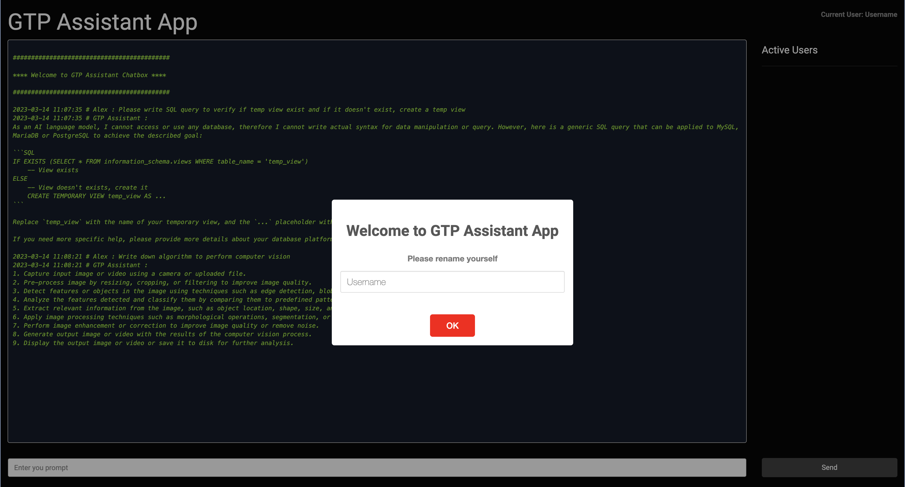
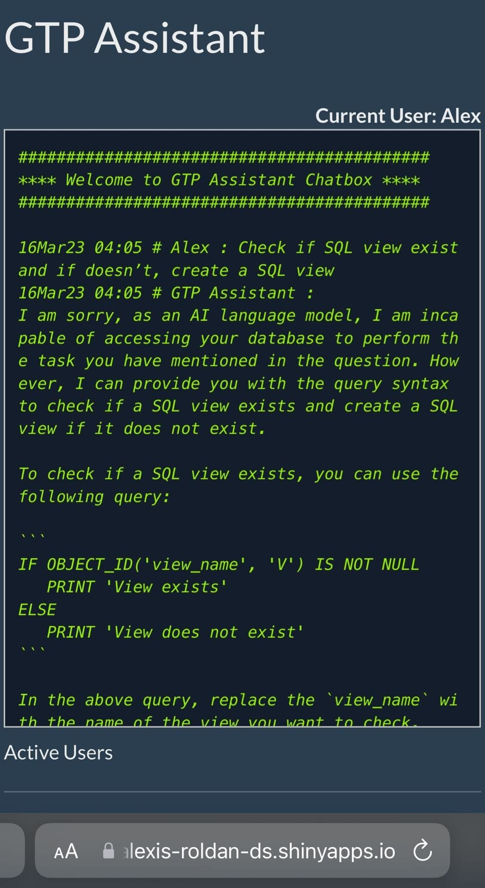

# GTP Assistant App
**IMPORTANT:** Please make sure to first get an *OpenAI API Key* before running the application.

# Overview
Interact with GPT through this R/Shiny application to process user's request prompts.

## Preview - Full Window


## Preview - Mobile Version


## Configuration
Create a `.Renviron` file and store your OpenAI API key
```shell
api_key <- <Your API Key>
```